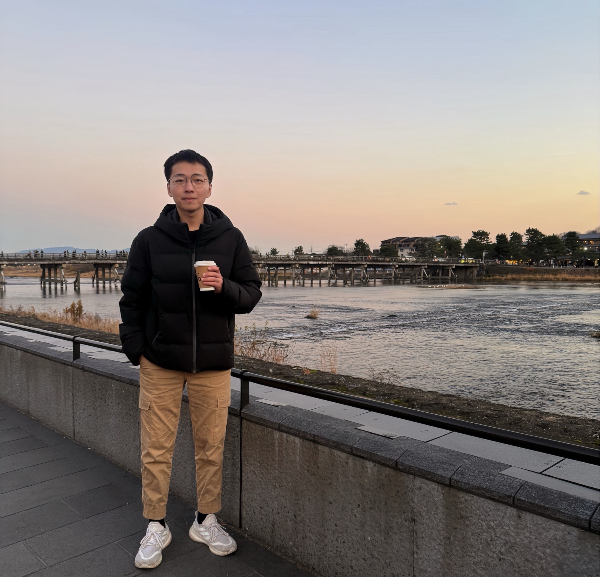

```{=html}
<style>
  /* Hide title and Copy Page on this page only */
  #title-block-header,
  .quarto-title-block,
  .copy-page-wrapper { display: none !important; }
</style>

<div style="margin-top: 1rem; margin-bottom: 2rem;">
  
</div>
```


#### 關於我

我是 Ian，畢業於台大經研所。架設本站的核心目標是建立一個**看得見的作品集**，將過去所學進行系統化的整理，並透過網站形式呈現出來。

我認為在這個時代，「空有想法」的價值有限，具備實作能力並進行數據驗證，更能凸顯身為商管背景學生的核心競爭力。

#### 內容規劃

目前的文章內容會以**動能量化研究**為主。選擇它作為起點，是因為價量資料的資訊密度高且處理過程相對單純。透過這類基礎策略，我能系統化地提升資料清洗、因子構建及回測框架建立等實作技巧。在累積足夠的價量實證經驗後，未來也會進一步探討細節處理較為複雜的基本面量化研究。

#### 未來展望

除了目前的量化研究，我也計畫將過去的實習專案，例如網路爬蟲與數據處理的相關經驗，一併分享於此。希望透過本站的紀錄，讓我也能重新整理過去的學習歷程。
