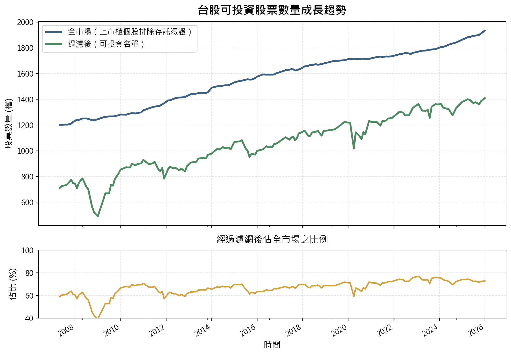
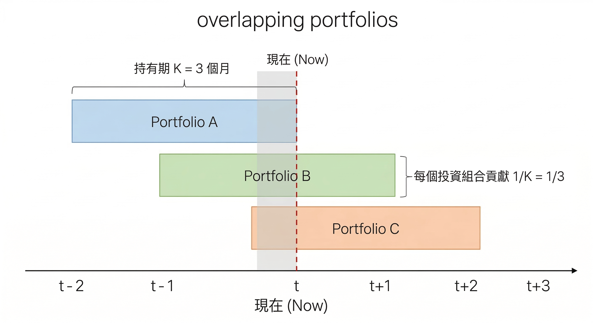

## 動能策略說明
### 動能策略是一種追高策略嗎？
動能策略確實是一種追高策略，但追的不是價格而是**價值**。換句話說：動能策略買的不是「已經漲很多的股票」，而是「應該還會繼續漲的股票」。

動能策略得以獲利的底層邏輯是目前股票的基本面改善了，再加上投資人**反應不足**的關係，因此股票價格尚未完全反映其價值。概念如下圖所示，儘管從歷史價格來看，在過去一段時間股票因為基本面改善已經有了明顯漲幅，但實際上根本還沒漲完，而動能策略在追的就是**反應不足下的這段潛在獲利**。


### 反應不足、反應過度
動能策略捕捉投資人反應不足的這個假設，可以透過實證結果來驗證。在股票價格終將反映股票價值的前提下，那會有以下兩種可能：

- 若當前價格是**反應過度**，則未來價格會反轉，造成**動能策略虧損**
- 若當前價格是**反應不足**，則未來價格會上升，造成**動能策略獲利**

而在台股的實證分析中，觀察到的狀況是價格、近高點及營收動能均能擊敗大盤。也就是說動能策略是一種可獲得超越大盤獲利的策略，支持了反應不足的假設。

::: {.callout-note}
## 反應不足的成因
反應不足可以由行為經濟學的**處置效應**所解釋，散戶在帳面獲利時往往急著賣出實現獲利，而帳面虧損時則是不願賣出實現虧損，造成價格往價值靠攏的過程中出現反向摩擦力，使價格往價值靠攏的速度變慢。
:::

::: {.callout-warning collapse="true"}
## 學術與實務對於台股動能有效性的分歧
學術論文用的是多空組合，他們在問「贏家 - 輸家有沒有超額報酬」

實務上用的是淨多頭部位，問的則是「精選的動能投資組合能否擊敗大盤」

兩者問的是不同的問題，答案不同並不矛盾，以投資人的角度我們更在意的是動能策略在實務上的可行性。
:::


<details class="faq-toggle">
<summary>如何定義價格動能</summary>
<div class="faq-answer">

價格動能是用過去一段時間的漲幅來衡量強弱，買進漲幅最高的那一組股票。

</div>
</details>

<details class="faq-toggle">
<summary>如何定義近高點動能</summary>
<div class="faq-answer">

近高點動能是利用目前股票價格 (分子) 與過去一段時間的最高價 (分母) 之比值來衡量股票強弱，買進比值最高的那一組股票。

</div>
</details>


## 回測框架設定
為了驗證動能策略在台股的有效性，且讓不同的動能指標能夠公平比較，因此必須設定一個統一的分析框架。考慮到台股歷史資料的可取得性，因此我使用的是 [FinLab](https://www.finlab.finance/) 所提供的資料以及相關函數來進行回測。 

### 設定投資市場範圍
我們設定可投資的市場範圍為**台股上市、上櫃個股，並排除存託憑證**。
```python
data.set_universe(market='TSE_OTC', 
                  exclude_category=['存託憑證'])
```

### 資料集概覽
回測會用到許多資料集，用於建構策略訊號、篩選標的以及計算報酬，為了讓大家對於資料有具體感，因此我將部分資料集的概覽整理如下，分別是日頻、月頻、季頻的資料：

> `Column` 是股票代號 (如：`2330`)，而 `Index` 則是日期 (如：`2025-12-31`)

::: {.panel-tabset}
## 收盤價
| **date/simbol** | **1101** | **1102** | **1103** | ... | **9958** | **9960** | **9962** |
| :--- | ---: | ---: | ---: | :---: | ---: | ---: | ---: |
| **2007-04-23** | 29.60 | 35.15 | 20.40 | ... | NaN | 46.00 | 49.60 |
| **2007-04-24** | 30.25 | 36.00 | 20.25 | ... | NaN | 45.90 | 50.40 |
| **2007-04-25** | 29.65 | 34.90 | 20.00 | ... | NaN | 49.10 | 49.10 |
| ... | ... | ... | ... | ... | ... | ... | ... |
| **2025-12-29** | 23.30 | 36.80 | 14.05 | ... | 140.50 | 21.25 | 10.15 |
| **2025-12-30** | 23.60 | 37.10 | 14.00 | ... | 139.00 | 21.25 | 10.15 |
| **2025-12-31** | 23.20 | 37.20 | 13.95 | ... | 139.50 | 21.45 | 10.35 |
4,600 rows × 2,177 columns (單位：元)

::: {.callout-tip}
## 日頻資料對齊
後續動能研究會以月頻率資料為主，因此日頻資料有兩種處理方法：

1. 取每月最後交易日的值作為月頻率資料代表，例如收盤價
2. 取每月日資料平均值作為月頻率資料代表，例如月均成交量
:::


## 月營收
| **date/simbol** | **1101** | **1102** | **1103** | ... | **9958** | **9960** | **9962** |
| :--- | ---: | ---: | ---: | :---: | ---: | ---: | ---: |
| **2005-02-10** | 2746766 | 1094966 | 271258 | ... | NaN | 37254 | NaN |
| **2005-03-10** | 1566092 | 663833 | 156962 | ... | NaN | 35983 | NaN |
| **2005-04-11** | 2504657 | 968271 | 234870 | ... | NaN | 39668 | NaN |
| ... | ... | ... | ... | ... | ... | ... | ... |
| **2025-10-13** | 13306676 | 6388217 | 234910 | ... | 1068557 | 65828 | 123005 |
| **2025-11-10** | 13882248 | 5833267 | 246707 | ... | 1149298 | 61699 | 130159 |
| **2025-12-10** | 13121753 | 5885302 | 249102 | ... | 1152612 | 51057 | 138574 |
251 rows × 2,171 columns (單位：千元)

::: {.callout-tip}
## 月營收資料
法規要求各上市櫃公司於每月 10 日前 (含) 公佈上月營收，但若遇例假日則順延至下一個營業日，因此有些 `date` 並非剛好在每月 10 日。為了回測時點的一致性，即使有些公司提早公布上月營收，但仍以公布截止日為準。
:::

## ROE
| **date/simbol** | **1101** | **1102** | **1103** | ... | **9958** | **9960** | **9962** |
| :--- | ---: | ---: | ---: | :---: | ---: | ---: | ---: |
| **2013-Q1** | 1.38 | 1.32 | 0.36 | ... | 4.04 | 1.07 | 4.08 |
| **2013-Q2** | 2.67 | 2.86 | -0.28 | ... | 3.04 | 3.01 | -0.61 |
| **2013-Q3** | 3.76 | 1.34 | 1.07 | ... | 2.98 | 2.14 | 2.05 |
| ... | ... | ... | ... | ... | ... | ... | ... |
| **2025-Q2** | 0.25 | 1.60 | -1.50 | ... | 3.76 | 0.19 | -2.35 |
| **2025-Q3** | -4.23 | 2.02 | 3.82 | ... | 1.97 | 3.30 | -0.64 |
| **2025-Q4** | NaN | NaN | NaN | ... | 3.73 | NaN | NaN |
52 rows × 2,067 columns (單位：百分比 %)

::: {.callout-tip}
## 季頻資料對齊
FinLab 提供了 `index_str_to_date()` 的方法，可以將季頻率的 `date` 欄位，如 `2025-Q2` 轉換為該股票季報實際接露的日期 `YYYY-MM-DD`，避免在量化分析中意外使用到未來資料的問題。
:::

:::

### 確認可投資標的
在設定完投資市場範圍後，接下來我們要針對可投資標的進行篩選，只有通過篩選的股票才能納入策略的投資範圍。

- **股價門檻 > 10 元**：\
低價股交易時會有滑價問題，且高機率為財務狀況不佳的股票
- **排除成交金額最低的 10% 股票**：\
考慮股票交易時的流動性，且因為市場熱度會使成交金額上下波動，因此這裡不設成交金額門檻，而是採用排名的方式動態調整
- **上市櫃滿 12 月**：\
考慮動能策略需要足夠的歷史資料計算訊號，因此這裡設定上市櫃滿 12 月
- **排除全額交割股**：\
股票被打入全額交割通常代表財務狀況有問題，故排除
- **排除注意股**：\
排除熱度過高的股票，因此若該股票過去 1 個月曾被標記為注意股，則不納入策略投資範圍
- **排除處置股**：\
排除熱度過高的股票，因此若該股票過去 3 個月曾被標記為處置股，則不納入策略投資範圍

由下圖可以發現，除了 2008-2009 金融海嘯時，股票可投資數量比例顯著下降以外，其餘時間可投資股票數量比例都維持在 60% - 80%，且隨者台股上市櫃股票數量增加，整體可投資股票數量也有所增加。




::: {.callout-note}
## 補充說明
在回測中，即使不加入篩選濾網，動能策略的有效性結論仍然成立。但因為我希望在回測時可以更加貼近現實狀況，因此加入上述篩選濾網。
:::

::: {.callout-tip collapse="true"}
## 為何排除熱度過高的股票
動能策略的底層邏輯是去捕捉股價反應不足的情況，也就是市場對於公司基本面變化的反應是緩慢的。

當股票被標記為注意股/處置股時，表示近期有異常的交易熱度，而這會導致動能訊號失真，因此不納入投資範圍。其中因為處置股的異常程度更高，因此設定更長的觀察期 (3 個月) 作為篩選規則。

以結果來說，不論有無排除熱度過高的股票，動能有效性結論不變。但排除熱度過高的股票後，動能訊號更加純粹，且整體的報酬表現也更好。
:::

### 回測期間
選擇 **2011-01-01** 至 **2025-12-31** 共計 15 年的月資料進行回測，一方面考慮到形成期的資料需求，一方面也是刻意選取的整數年份。

計算價格動能與近高點動能所需的收盤價歷史資料是從 2007 年 4 月底開始。由於動能訊號的計算需要基於過往一段時間的資料 (形成期)，因此以 2011 年建構的投資組合來說，就會需要用到 2010 年甚至 2009 年的歷史資料，這也是為何無法直接從 2007 年或是 2008 年開始進行回測的原因。

::: {.callout-note collapse="true"}
## 為何回測期間沒有包含金融海嘯
2008-2009 為金融海嘯期間，由於回測考慮到形成期的完整性，因此無法從金融海嘯期間開始回測。
:::

### 投資組合建構
建構動能投資組合有兩個最重要的參數，分別是投資組合形成期 (過去 $J$ 個月) 與投資組合持有期 (未來 $K$ 個月)，建構步驟如下：

1. 排除不符合篩選條件的股票
2. 每個月基於過去 $J$ 個月的歷史資料，計算股票的動能訊號
3. 根據動能訊號進行橫斷面排序，將股票由高至低排序，等分成 10 組
4. 挑選前 10% 的股票組成**等權重投資組合**
5. 持有投資組合 $K$ 個月後，進行換股
6. 重複步驟 1-5，直到回測結束

<details class="faq-toggle">
<summary>為何是分成 10 組</summary>
<div class="faq-answer">
依照策略訊號分成 10 組是學術文獻上的慣例，目的是觀察報酬在 10 組之間是否有單調性，也就是訊號越強、報酬越高。此外也能夠觀察訊號最強的組別與最弱的組別之間的報酬率差距是否顯著。

因此分成 5 組或是任意組別數也是可以的，但關鍵在於每組投資組合內的標的數量需要足夠，若過度細分造成組合內僅有少量股票，則投資組合的表現更多是反映標的的個股特性，而不是動能策略的表現。

以台股為例，將通過濾網的股票依照訊號強度分成 10 組後，每組約有 100 多檔的股票，個股風險足夠分散，投資組合更能反映動能訊號的表現。
</div>
</details>

<details class="faq-toggle">
<summary>為何是等權重投資組合</summary>
<div class="faq-answer">
使用等權重投資組合，而非按市值加權是為了避免動能策略的報酬受到市值規模的影響。
</div>
</details>

<details class="faq-toggle">
<summary>J 和 K 的最佳值是多少</summary>
<div class="faq-answer">
不同策略的 $J$ 和 $K$ 的最佳值是不同的。整體來說，在不考慮手續費、交易稅的狀況下，每月換股 ($K = 1$) 的動能策略表現較佳。但形成期 ($J$) 的最佳值則各策略不同。
</div>
</details>

### 重複投資組合
重複投資組合的概念就是每個月持有多個**不同時間點建立、但仍在持有期內**的投資組合，而非每 $K$ 個月才全部換倉，其中這 $K$ 個投資組合各自對整體報酬的貢獻為 $\dfrac{1}{K}$。

這樣做的好處在於每個月皆會調倉，避免一年中某幾個月市場通常表現較好或較差，而調倉期間剛好都在這些月份，造成報酬率不具代表性的狀況。

::: {.callout-tip}
## $K = 1$ 是特例
由於 $K = 1$ 的情況下，每個月都只會持有一個投資組合，因此重複投資組合就等於策略本身的月調倉。
:::




### 報酬率計算
報酬率的計算為樣本期間內，所有月報酬率的**簡單平均數**並且 $\times 12$ 變成**年化月均報酬率**，方便比較。除非另有說明否則報酬率都是在不考慮手續費、交易稅下的報酬率，目的是真實反映動能策略的表現，而不受摩擦成本影響。

但在後續針對不同動能策略的實證研究時我也會提供含手續費、交易稅的報酬率，目的是觀察摩擦成本對於策略所造成的實際影響多大。

<details class="faq-toggle">
<summary>為何不用幾何平均數計算報酬率</summary>
<div class="faq-answer">

簡單平均數反映的是期望的月報酬（每個月獨立的問這個月平均賺多少），幾何平均數反映的是實際財富累積路徑（受順序和波動影響）。用於比較策略的預期績效時，簡單平均數更合適。
</div>
</details>

<details class="faq-toggle">
<summary>簡單平均數的侷限性為何</summary>
<div class="faq-answer">

雖然在比較預期績效時，簡單平均數更加直觀合理，但實務上我們更重視的是財富的年複合成長率 (幾何平均數)，且從算幾不等式可知：**算術平均數是對於報酬率最樂觀的預期，而報酬的波動度越大，則現實跟預期落差越大**。

$$
\underbrace{\frac{1}{T}\sum_{t=1}^{T}r_t}_{\text{算術平均數}}
\geq
\underbrace{\left(\prod_{t=1}^{T}(1+r_t)\right)^{1/T} - 1}_{\text{幾何平均數 (CAGR)}}
\approx \bar{r} - \frac{\sigma^2}{2}
$$

</div>
</details>

<details class="faq-toggle">
<summary>所謂報酬率擊敗大盤，是指哪種報酬率</summary>
<div class="faq-answer">

動能策略通常具有較高的波動度，因此僅比較簡單平均數等於是忽略波動度對於財富累積造成的負面影響。

因此報酬率擊敗大盤表示的是：回測期間內，在考慮手續費與交易稅的狀況下

- 動能策略的簡單平均數報酬率勝過大盤
- 動能策略的幾何平均數報酬率勝過大盤 \
(反映在動能策略的財富終值比投資大盤要高)

</div>
</details>


### 大盤比較基準
台股大盤的定義，則是使用**發行量加權股價報酬指數**，該指數包含了配股配息後的總報酬，雖然該指數是按市值加權，和等權重的動能投資組合不同，但因為該指數是實務上常做為投資策略的比較基準，因此仍具有參考意義。

### 結語
本文章主要說明了動能策略的底層邏輯，以及針對後續不同動能策略的實證研究，建立共同的分析框架以便進行比較分析。

在接下來的文章中，將會利用目前的分析框架針對價格動能、近高點動能、營收動能進行實證研究，除了探討策略的有效性以外，也分析動能訊號的穩定度。需要注意的是實證研究是基於過去的歷史資料，不代表同樣的策略在未來也會有一樣的表現。